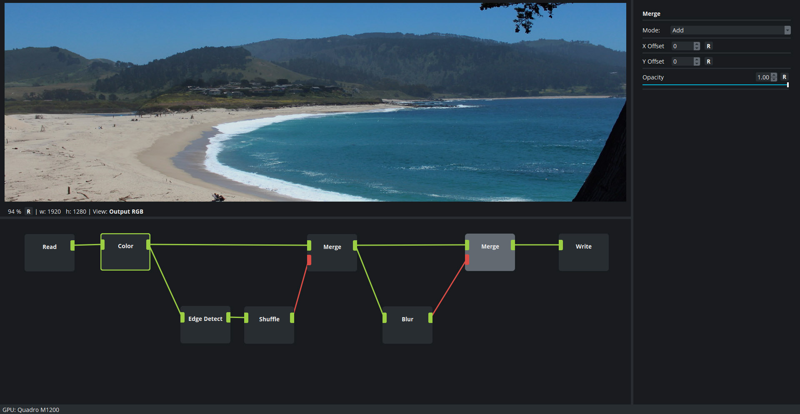

# Cascade Image Editor

[](https://jenkins.marvao.net/view/job/Cascade) [](https://jenkins.marvao.net/view/job/CascadeWin) [](https://jenkins.marvao.net/view/job/CascadeTests)

   

Cascade is a node-based image editor with GPU-acceleration.

This is still an early prototype.

## Download

Cascade is free software. If you want to try it out, the latest binaries for Windows are [here](https://github.com/ttddee/Cascade/releases).

If you want to get involved or have questions, please join our [Discord](https://discord.gg/SHPHqgKtFM).

## Features

- Non-destructive node-based editing workflow
- All image processing is done on the GPU
- 32 bit linear color pipeline
- Support for the most common color spaces and file formats

## Shortcuts

- **F1** - View selected node front input
- **F2** - View selected node back input
- **F3** - View selected node alpha input
- **F4** - Toggle between selected node RGB output and alpha output
- **Delete** - Delete selected node

- **Ctrl + Left Click** - Reset slider to default

## Build

### Windows

I order to build on Windows you will need the following:

- [Vulkan SDK](https://www.lunarg.com/vulkan-sdk)
- A Vulkan-capable graphics driver. [Here](https://vulkan.gpuinfo.org/) is a list of compatible devices and driver versions.
- [Microsoft VcPkg](https://github.com/microsoft/vcpkg) is not a must but makes it easy to install the dependencies.
- MSVC. Comes with Visual Studio.
- [Qt](https://www.qt.io/) version 5.10 or above.

#### Clone the project

```console
git clone --recurse-submodules https://github.com/ttddee/Cascade
```

#### Install dependencies

From your VcPkg folder do:

```console
vcpkg install openimageio:x64-windows

vcpkg install opencolorio:x64-windows

vcpkg install gtest:x64-windows
```


#### Build submodule

Open the project file *Cascade/external/qtadvanceddocking/ads.pro* in QtCreator and configure it for **MSVC2019 x64**. 

Specify *Cascade/external/qtadvanceddocking/build* as your build directory.

Now build both *debug* and *release* targets within QtCreator.


#### Configure Cascade.pro

Open *Cascade.pro* in QtCreator. Configure **MSVC2019 x64** as compiler and *Cascade/build* as your build directory.

In the Windows section of the .pro file (win32-msvc*) there are three variables that tell QMake where to find stuff:

**VCPKG_INSTALL_PATH**: Point this to your VcPkg install directory. In my case that is *C:/Users/till/vcpkg*.

**QT_INSTALL_PATH**: Point this to your Qt installation. In my case that is *C:/Qt515/5.15.1*.

**MSVC_INSTALL_PATH**: Point this to where the MSVC compilers binaries are. 
In my case that is *C:/Program Files (x86)/Microsoft Visual Studio/2019/Community/VC/Tools/MSVC/14.27.29110/bin/Hostx64/x64*.

If all went well you should be able to build the project now.


## Linux

### Ubuntu (Tested on 20.10)

#### Clone the project

``` bash
git clone --recurse-submodules https://github.com/ttddee/Cascade
```

#### Install dependencies

Install the latest Qt including QtCreator from [here](https://www.qt.io/download).

Open a shell and install the following packages:

``` bash
sudo apt update

sudo apt install libopenimageio-dev libopencolorio-dev libgmic-dev libtbb2 libvulkan-dev
```

#### Build submodule

Open the project file **Cascade/external/qtadvanceddocking/ads.pro** in QtCreator and configure it for **G++**. 

Specify **Cascade/external/qtadvanceddocking/build** as your build directory.

Now build both **debug** and **release** targets within QtCreator.

You can either copy the headers and library to your **/usr** folder, or configure a custom location in the next step.

#### Configure Cascade.pro

Open **Cascade.pro** in QtCreator. Configure **G++** as compiler and **Cascade/build** as your build directory.

If you haven't copied the files for **QtAdvancedDocking** to your **/usr** directory in the last step, you can set a custom path in the **linux-g++** section of the **.pro** file.

For example:

``` qmake
LIBS += -L /home/user/Cascade/external/qtadvanceddocking -lqtadvanceddocking
```

Now you should be able to build the project in QtCreator.
