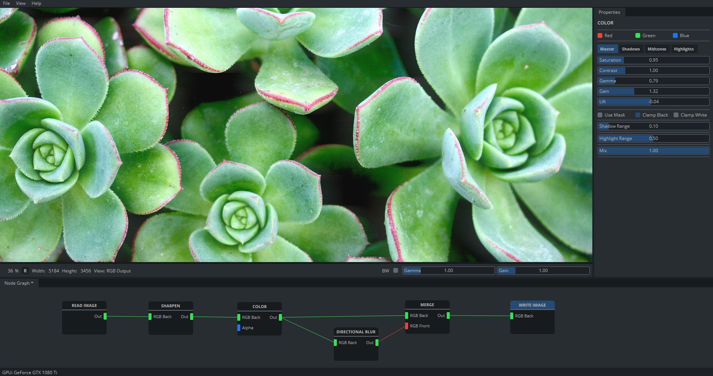

  

<h3 align="center">
  node-based image editor
</h3>

Welcome to the Cascade project!

[Usage](https://cascadedocs.readthedocs.io/en/latest/usage.html) - [Quickstart](https://cascadedocs.readthedocs.io/en/latest/quickstart.html) - [Building from Source](https://cascadedocs.readthedocs.io/en/latest/buildingfromsource.html) - [Contributing](https://cascadedocs.readthedocs.io/en/latest/contributing.html) - [Documentation](https://cascadedocs.readthedocs.io/en/latest/index.html) - [Discord](https://discord.gg/SHPHqgKtFM)
  
 

   

 

## Features at a glance

- Non-destructive, node-based editing workflow.
- Batch processing.
- All image processing is done on the GPU.
- 32 bit (per channel), linear color pipeline.
- Support for the most common color spaces and file formats.
- You can write your own image processing effects using GLSL. A quick introduction on how to do that is [here](https://cascadedocs.readthedocs.io/en/latest/writingshader.html).
- Or you can use existing [ISF shaders](https://cascadedocs.readthedocs.io/en/latest/isfshaders.html) to add effects to your images.

## Download

Cascade is free software. If you want to try it out, get started [here](https://cascadedocs.readthedocs.io/en/latest/usage.html).

If you want to get involved or have questions, please join our [Discord](https://discord.gg/SHPHqgKtFM) and see [the page about contributing](https://cascadedocs.readthedocs.io/en/latest/contributing.html).

## Tech

Cascade is written in C++ and runs on Windows and Linux. You will need a [Vulkan-compatible GPU](https://vulkan.gpuinfo.org/) to run the software.

The GUI was created in [Qt](https://www.qt.io/) and all rendering is done on the GPU through [Vulkan](https://www.vulkan.org/) with GLSL as shading language.

For IO and color space conversion we are using [OpenImageIO](https://github.com/OpenImageIO/oiio)/[OpenColorIO](https://opencolorio.org/).

Multithreaded computations on the CPU are done with [TBB](https://github.com/oneapi-src/oneTBB).

